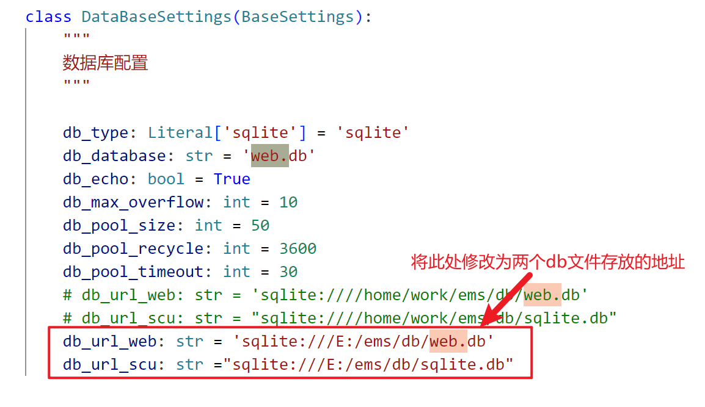
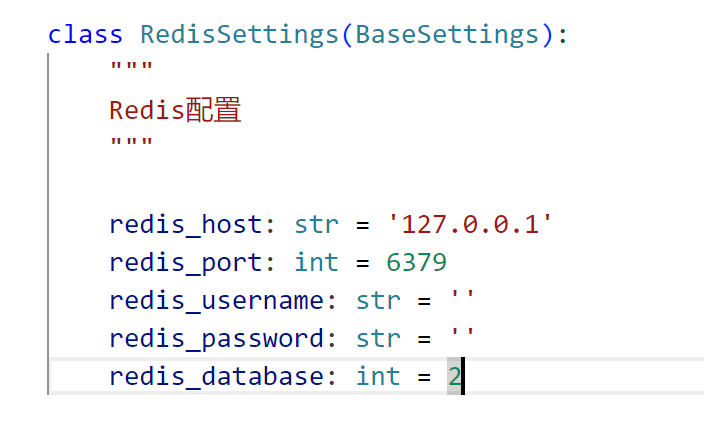
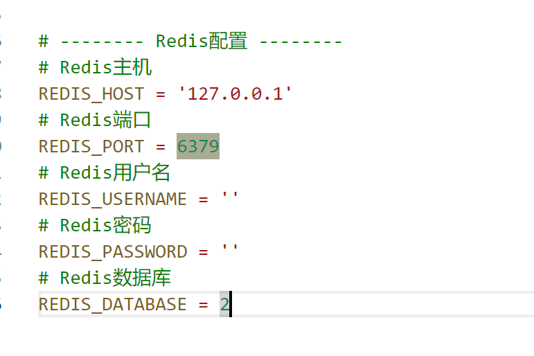

## 项目开发及发布相关

### 开发

#### 前端

```bash
# 进入项目根目录
cd web-frontend

# 安装依赖
npm install

# 建议不要直接使用 cnpm 安装依赖，会有各种诡异的 bug。可以通过如下操作解决 npm 下载速度慢的问题
npm install --registry=https://registry.npmmirror.com

# 启动服务
npm run dev
```

#### 后端

```bash
# 进入项目根目录
cd web-backend

# 执行以下命令安装项目依赖环境（前提是已安装好python环境）
pip3 install -r requirements.txt
```

# 配置环境

在.env.dev 文件中配置开发环境的数据库和 redis

- web-backend\config\env.py
<div></div>

- redis:web-backend\config\env.py
<div></div>

- .env.dev
<div></div>

# 将数据库放到对应文件夹下

```bash
# 运行后端
python3 app.py --env=dev
```

#### 访问

```bash
# 默认账号密码
账号：admin
密码：admin123

# 浏览器访问
地址：http://localhost:80
```

### 发布

#### 前端

```bash
# 构建测试环境
npm run build:stage

# 构建生产环境
npm run build:prod
```

#### 后端

```bash
# 配置环境
在.env.prod文件中配置生产环境的数据库和redis

# 运行后端
python3 app.py --env=prod
```
